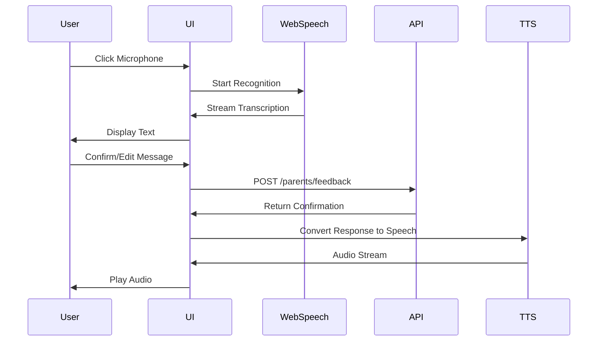

# Design Document: Parent Portal

## Overview

The Parent Portal is a dedicated interface that allows parents to monitor their child's academic performance, view detailed statistics, and communicate with the system through voice messages. The design follows the existing application architecture using React, React Router, Context API for state management, and Tailwind CSS for styling. The portal will be completely isolated from the student interface to ensure no cross-contamination of UI/UX.

### Key Design Principles

1. **Separation of Concerns**: Parent and student interfaces are completely separate with distinct routes, contexts, and components
2. **Consistent Architecture**: Follow existing patterns (Context API, utility functions, component structure)
3. **Responsive Design**: Mobile-first approach with touch-friendly controls
4. **Accessibility**: WCAG 2.1 AA compliance with ARIA labels and keyboard navigation
5. **Progressive Enhancement**: Voice features with text fallbacks

## Architecture

### High-Level Architecture Diagram

```mermaid
graph TB
    subgraph "Parent Portal"
        PR[Parent Routes] --> PL[Parent Layout]
        PL --> PD[Parent Dashboard]
        PL --> PV[Parent Voice Assistant]
        PL --> PP[Parent Profile]
        
        PC[ParentContext] --> PD
        PC --> PV
        PC --> PP
        
        PAPI[Parent API Utils] --> PC
    end
    
    subgraph "Student Portal (Existing)"
        SR[Student Routes] --> SL[MainLayout]
        SL --> SH[Home]
        SL --> SE[Explore]
        SL --> SP[Profile]
        
        UC[UserContext] --> SH
        UC --> SE
        UC --> SP
    end
    
    subgraph "Backend APIs"
        PAPI --> PREG[/parents/register]
        PAPI --> PLOG[/parents/login]
        PAPI --> PSTAT[/parents/stats]
        PAPI --> PFEED[/parents/feedback]
    end
    
    subgraph "Browser APIs"
        PV --> WSR[Web Speech Recognition]
        PV --> WSS[Web Speech Synthesis]
    end
```

### Directory Structure

```
src/
├── contexts/
│   ├── UserContext.jsx (existing - student)
│   └── ParentContext.jsx (new - parent authentication & state)
├── layouts/
│   ├── MainLayout.jsx (existing - student)
│   └── ParentLayout.jsx (new - parent UI wrapper)
├── pages/
│   ├── parent/
│   │   ├── ParentLogin.jsx (new - parent auth)
│   │   ├── ParentRegister.jsx (new - parent registration)
│   │   ├── ParentDashboard.jsx (new - stats & performance)
│   │   ├── ParentVoiceAssistant.jsx (new - voice messaging)
│   │   └── ParentProfile.jsx (new - parent profile management)
│   ├── Home.jsx (existing - student)
│   ├── Profile.jsx (existing - student)
│   └── ... (other student pages)
├── components/
│   ├── parent/
│   │   ├── ParentHeader.jsx (new - parent navigation)
│   │   ├── ParentBottomNav.jsx (new - parent bottom nav)
│   │   ├── StatsCard.jsx (new - performance metrics)
│   │   ├── ComparisonChart.jsx (new - class comparison)
│   │   ├── VoiceRecorder.jsx (new - voice recording UI)
│   │   └── VoicePlayer.jsx (new - audio playback)
│   └── ... (existing student components)
├── utils/
│   ├── parentApi.js (new - parent API calls)
│   ├── voiceUtils.js (new - speech recognition/synthesis)
│   ├── userApi.js (existing - student API)
│   └── ... (other utilities)
└── App.jsx (updated - add parent routes)
```

## Components and Interfaces

### 1. ParentContext

**Purpose**: Manage parent authentication state and provide parent-specific data throughout the parent portal.

**State Management**:
```javascript
{
  parent: {
    id: number,
    username: string,
    name: string,
    phone_number: string,
    student_username: string
  } | null,
  loading: boolean,
  stats: {
    child: {
      username: string,
      name: string,
      class_level: string,
      level: number,
      total_attempts: number,
      correct_attempts: number,
      accuracy: number,
      score: number,
      current_streak: number,
      max_streak: number
    },
    comparison: {
      class_count: number,
      avg_score: number,
      avg_accuracy: number,
      top_score: number,
      rank: number,
      percentile: number
    }
  } | null,
  statsLoading: boolean
}
```

**Methods**:
- `login(username, password)`: Authenticate parent and store JWT token
- `register(parentData)`: Register new parent account
- `logout()`: Clear authentication and redirect
- `fetchStats()`: Get child's performance statistics
- `sendFeedback(message)`: Send feedback to be stored with student
- `updateParent(updates)`: Update parent profile information

**Implementation Pattern**:
```javascript
export function ParentProvider({ children }) {
  const [parent, setParent] = useState(null);
  const [stats, setStats] = useState(null);
  const [loading, setLoading] = useState(true);
  const [statsLoading, setStatsLoading] = useState(false);

  useEffect(() => {
    // Check for existing parent token on mount
    const token = localStorage.getItem("parentToken");
    if (token) {
      // Validate token and fetch parent data
      fetchParentData(token);
    }
    setLoading(false);
  }, []);

  // ... method implementations
}
```

### 2. ParentLayout

**Purpose**: Provide consistent layout wrapper for all parent pages with navigation and styling.

**Features**:
- Parent-specific header with navigation
- Bottom navigation for mobile
- Gradient background matching student theme but with distinct color scheme
- Responsive container with backdrop blur effect

**Visual Design**:
- Background: Gradient from purple-600 to indigo-700 (distinct from student's blue-600 to indigo-700)
- Container: White/10 backdrop blur with rounded corners
- Navigation: Fixed header and bottom nav for mobile-first design

**Component Structure**:
```javascript
export default function ParentLayout({ children }) {
  return (
    <div className="h-screen w-screen bg-gradient-to-b from-purple-600 to-indigo-700 p-2 flex justify-center items-center">
      <div className="w-full max-w-sm sm:max-w-md md:max-w-lg lg:max-w-xl h-full 
                     bg-white/10 backdrop-blur-lg rounded-2xl shadow-2xl 
                     p-4 flex flex-col">
        <ParentHeader />
        <div className="flex-1 overflow-y-auto">
          {children}
        </div>
        <ParentBottomNav />
      </div>
    </div>
  );
}
```

### 3. ParentDashboard

**Purpose**: Display child's performance metrics and class comparisons in an intuitive, visual format.

**Layout Sections**:

1. **Child Overview Card**
   - Student name and username
   - Class level and current level
   - Profile avatar (if available)

2. **Performance Metrics Grid**
   - Total Attempts (with icon)
   - Correct Attempts (with checkmark icon)
   - Accuracy Percentage (with progress bar)
   - Score (with star rating visualization)
   - Current Streak (with fire icon)
   - Max Streak (with trophy icon)

3. **Class Comparison Section**
   - Rank display: "7 out of 48 students"
   - Percentile badge: "Top 15%"
   - Bar chart comparing child's score vs class average vs top score
   - Accuracy comparison with visual indicator

**Data Visualization**:
- Use Chart.js or Recharts for bar/line charts
- Progress bars for percentages
- Color coding: Green for above average, Yellow for average, Red for below average
- Animated counters for numbers (similar to existing Profile page)

**Responsive Design**:
- Mobile: Single column stack
- Tablet: 2-column grid for metrics
- Desktop: 3-column grid with larger charts

### 4. ParentVoiceAssistant

**Purpose**: Enable voice-based communication with text fallback for feedback and queries.

**UI Components**:

1. **Voice Recorder Component**
   - Large circular microphone button (touch-friendly, min 60px)
   - Visual feedback: Pulsing animation when recording
   - Waveform visualization during recording
   - Timer showing recording duration
   - Stop/Cancel buttons

2. **Transcription Display**
   - Real-time text display as speech is converted
   - Edit capability before sending
   - Character count indicator
   - Send button (disabled until transcription complete)

3. **Message History**
   - Scrollable list of sent messages
   - Timestamp for each message
   - Visual distinction between sent and received messages
   - Audio playback controls for responses

4. **Voice Player Component**
   - Play/Pause button
   - Progress bar with time indicators
   - Volume control
   - Speed control (0.5x, 1x, 1.5x, 2x)
   - Replay button

**Voice Processing Flow**:


**Error Handling**:
- Microphone permission denied: Show instructions with fallback to text input
- Speech recognition unavailable: Automatically show text input
- Network error: Queue message for retry with offline indicator
- TTS unavailable: Display text response only

### 5. ParentProfile

**Purpose**: Display and edit parent account information.

**Features**:
- Display parent username (read-only)
- Editable fields: name, phone number
- Display linked student username (read-only)
- Logout button
- Password change option (future enhancement)

**Form Validation**:
- Phone number: Format validation (international format support)
- Name: Required, min 2 characters
- Real-time validation feedback

## Data Models

### Parent Authentication

```typescript
interface ParentCreate {
  username: string;
  password: string;
  name?: string;
  phone_number?: string;
  student_username: string;
}

interface ParentLogin {
  username: string;
  password: string;
}

interface ParentOut {
  id: number;
  username: string;
  name: string | null;
  phone_number: string | null;
  student_username: string;
}

interface AuthResponse {
  access_token: string;
  token_type: string;
}
```

### Parent Stats

```typescript
interface ChildStats {
  username: string;
  name: string;
  class_level: string;
  level: number;
  total_attempts: number;
  correct_attempts: number;
  accuracy: number;
  score: number;
  current_streak: number;
  max_streak: number;
}

interface ComparisonStats {
  class_count: number;
  avg_score: number;
  avg_accuracy: number;
  top_score: number;
  rank: number;
  percentile: number;
}

interface ParentStatsOut {
  child: ChildStats;
  comparison: ComparisonStats;
}
```

### Feedback

```typescript
interface ParentFeedback {
  feedback: string;
}

interface FeedbackResponse {
  status: string;
  student_username: string;
  Parent_feedback: string;
}
```

## API Integration

### Parent API Utility (`src/utils/parentApi.js`)

```javascript
const API_URL = import.meta.env.VITE_API_URL || "http://localhost:8000";

export async function registerParent(data) {
  const res = await fetch(`${API_URL}/parents/register`, {
    method: "POST",
    headers: { "Content-Type": "application/json" },
    body: JSON.stringify(data),
  });

  if (!res.ok) {
    const err = await res.json();
    throw new Error(err.detail || "Registration failed");
  }

  return res.json();
}

export async function loginParent({ username, password }) {
  const res = await fetch(`${API_URL}/parents/login`, {
    method: "POST",
    headers: { "Content-Type": "application/json" },
    body: JSON.stringify({ username, password }),
  });

  if (!res.ok) {
    const err = await res.json();
    throw new Error(err.detail || "Invalid credentials");
  }

  return res.json();
}

export async function fetchParentStats(token) {
  const res = await fetch(`${API_URL}/parents/stats`, {
    headers: { Authorization: `Bearer ${token}` },
  });

  if (!res.ok) {
    const err = await res.json();
    throw new Error(err.detail || "Failed to fetch stats");
  }

  return res.json();
}

export async function sendParentFeedback(feedback, token) {
  const res = await fetch(`${API_URL}/parents/feedback`, {
    method: "POST",
    headers: {
      "Content-Type": "application/json",
      Authorization: `Bearer ${token}`,
    },
    body: JSON.stringify({ feedback }),
  });

  if (!res.ok) {
    const err = await res.json();
    throw new Error(err.detail || "Failed to send feedback");
  }

  return res.json();
}
```

### Token Management

- Parent tokens stored separately from student tokens
- Key: `parentToken` in localStorage
- Automatic token refresh on API 401 responses
- Token validation on app mount

## Voice Processing

### Voice Utilities (`src/utils/voiceUtils.js`)

```javascript
// Speech Recognition (Voice to Text)
export class VoiceRecognition {
  constructor() {
    const SpeechRecognition = window.SpeechRecognition || window.webkitSpeechRecognition;
    if (!SpeechRecognition) {
      throw new Error("Speech recognition not supported");
    }
    this.recognition = new SpeechRecognition();
    this.recognition.continuous = true;
    this.recognition.interimResults = true;
    this.recognition.lang = 'en-US'; // Configurable
  }

  start(onResult, onError) {
    this.recognition.onresult = (event) => {
      const transcript = Array.from(event.results)
        .map(result => result[0].transcript)
        .join('');
      onResult(transcript, event.results[event.results.length - 1].isFinal);
    };
    
    this.recognition.onerror = onError;
    this.recognition.start();
  }

  stop() {
    this.recognition.stop();
  }
}

// Speech Synthesis (Text to Voice)
export class VoiceSynthesis {
  constructor() {
    if (!window.speechSynthesis) {
      throw new Error("Speech synthesis not supported");
    }
    this.synth = window.speechSynthesis;
  }

  speak(text, options = {}) {
    const utterance = new SpeechSynthesisUtterance(text);
    utterance.rate = options.rate || 1.0;
    utterance.pitch = options.pitch || 1.0;
    utterance.volume = options.volume || 1.0;
    utterance.lang = options.lang || 'en-US';
    
    if (options.onEnd) utterance.onend = options.onEnd;
    if (options.onError) utterance.onerror = options.onError;
    
    this.synth.speak(utterance);
  }

  stop() {
    this.synth.cancel();
  }

  pause() {
    this.synth.pause();
  }

  resume() {
    this.synth.resume();
  }

  getVoices() {
    return this.synth.getVoices();
  }
}

// Utility functions
export function checkVoiceSupport() {
  return {
    recognition: !!(window.SpeechRecognition || window.webkitSpeechRecognition),
    synthesis: !!window.speechSynthesis
  };
}

export async function requestMicrophonePermission() {
  try {
    const stream = await navigator.mediaDevices.getUserMedia({ audio: true });
    stream.getTracks().forEach(track => track.stop());
    return true;
  } catch (error) {
    return false;
  }
}
```

## Routing

### Updated App.jsx Routes

```javascript
<Routes>
  {/* Student Routes (Existing) */}
  <Route path="/" element={<Home />} />
  <Route path="/history" element={<MainLayout>{(props) => <History {...props} />}</MainLayout>} />
  <Route path="/math" element={<MainLayout>{(props) => <Explore {...props} />}</MainLayout>} />
  <Route path="/profile" element={<MainLayout>{(props) => <Profile {...props} />}</MainLayout>} />
  
  {/* Parent Routes (New) */}
  <Route path="/parent/login" element={<ParentLogin />} />
  <Route path="/parent/register" element={<ParentRegister />} />
  <Route path="/parent/dashboard" element={<ParentLayout><ParentDashboard /></ParentLayout>} />
  <Route path="/parent/voice" element={<ParentLayout><ParentVoiceAssistant /></ParentLayout>} />
  <Route path="/parent/profile" element={<ParentLayout><ParentProfile /></ParentLayout>} />
</Routes>
```

### Route Protection

```javascript
// ProtectedParentRoute component
function ProtectedParentRoute({ children }) {
  const { parent, loading } = useParent();
  
  if (loading) return <LoadingSpinner />;
  if (!parent) return <Navigate to="/parent/login" />;
  
  return children;
}

// Usage
<Route 
  path="/parent/dashboard" 
  element={
    <ProtectedParentRoute>
      <ParentLayout><ParentDashboard /></ParentLayout>
    </ProtectedParentRoute>
  } 
/>
```

## Error Handling

### Error Boundary

Implement React Error Boundary for parent portal:

```javascript
class ParentErrorBoundary extends React.Component {
  state = { hasError: false, error: null };

  static getDerivedStateFromError(error) {
    return { hasError: true, error };
  }

  componentDidCatch(error, errorInfo) {
    console.error("Parent Portal Error:", error, errorInfo);
    // Log to error tracking service
  }

  render() {
    if (this.state.hasError) {
      return (
        <div className="error-container">
          <h2>Something went wrong</h2>
          <button onClick={() => window.location.href = '/parent/dashboard'}>
            Return to Dashboard
          </button>
        </div>
      );
    }

    return this.props.children;
  }
}
```

### API Error Handling

```javascript
async function handleApiCall(apiFunction, ...args) {
  try {
    return await apiFunction(...args);
  } catch (error) {
    if (error.message.includes('401') || error.message.includes('token')) {
      // Token expired
      localStorage.removeItem('parentToken');
      window.location.href = '/parent/login';
    } else if (error.message.includes('404')) {
      // Resource not found
      showNotification('Resource not found', 'error');
    } else if (error.message.includes('network')) {
      // Network error
      showNotification('Network error. Please check your connection.', 'error');
    } else {
      // Generic error
      showNotification(error.message || 'An error occurred', 'error');
    }
    throw error;
  }
}
```

## Testing Strategy

### Unit Tests

1. **Context Tests**
   - ParentContext state management
   - Authentication flow
   - Stats fetching and caching

2. **Component Tests**
   - ParentDashboard rendering with mock data
   - VoiceRecorder UI interactions
   - Form validation in ParentRegister

3. **Utility Tests**
   - API functions with mocked fetch
   - Voice utilities with mocked Web APIs
   - Token management functions

### Integration Tests

1. **Authentication Flow**
   - Register → Login → Dashboard navigation
   - Token persistence across page reloads
   - Logout and token cleanup

2. **Stats Display**
   - Fetch stats on dashboard mount
   - Refresh stats functionality
   - Error handling for missing data

3. **Voice Features**
   - Record → Transcribe → Send flow
   - Receive → Synthesize → Play flow
   - Fallback to text input

### E2E Tests (Cypress/Playwright)

1. **Parent Registration Journey**
   - Navigate to register page
   - Fill form with valid data
   - Submit and verify redirect to login

2. **Dashboard Interaction**
   - Login as parent
   - Verify stats display
   - Navigate between pages
   - Logout

3. **Voice Assistant**
   - Grant microphone permission
   - Record voice message
   - Verify transcription display
   - Send message and receive response

### Accessibility Tests

1. **Keyboard Navigation**
   - Tab through all interactive elements
   - Verify focus indicators
   - Test Enter/Space key activation

2. **Screen Reader**
   - ARIA labels on all controls
   - Announcements for dynamic content
   - Proper heading hierarchy

3. **Color Contrast**
   - Verify WCAG AA compliance
   - Test with color blindness simulators

## Performance Considerations

### Optimization Strategies

1. **Code Splitting**
   - Lazy load parent routes
   - Separate bundle for parent portal
   - Reduce initial load time

```javascript
const ParentDashboard = lazy(() => import('./pages/parent/ParentDashboard'));
const ParentVoiceAssistant = lazy(() => import('./pages/parent/ParentVoiceAssistant'));
```

2. **Data Caching**
   - Cache stats data for 5 minutes
   - Implement stale-while-revalidate pattern
   - Use React Query or SWR for data fetching

3. **Voice Processing**
   - Debounce transcription updates
   - Limit audio file sizes
   - Use Web Workers for heavy processing

4. **Image Optimization**
   - Lazy load images
   - Use WebP format with fallbacks
   - Implement progressive loading

### Performance Metrics

- First Contentful Paint (FCP): < 1.5s
- Largest Contentful Paint (LCP): < 2.5s
- Time to Interactive (TTI): < 3.5s
- Cumulative Layout Shift (CLS): < 0.1

## Security Considerations

### Authentication Security

1. **Token Storage**
   - Store JWT in localStorage (acceptable for this use case)
   - Consider httpOnly cookies for production
   - Implement token refresh mechanism

2. **API Security**
   - Always send tokens in Authorization header
   - Validate token on every protected route
   - Implement CSRF protection

3. **Input Validation**
   - Sanitize all user inputs
   - Validate on both client and server
   - Prevent XSS attacks

### Privacy

1. **Data Protection**
   - Don't log sensitive information
   - Encrypt data in transit (HTTPS)
   - Implement proper CORS policies

2. **Voice Data**
   - Process voice locally when possible
   - Don't store audio recordings
   - Clear transcriptions after sending

## Accessibility Features

### WCAG 2.1 AA Compliance

1. **Perceivable**
   - Text alternatives for all non-text content
   - Color contrast ratio ≥ 4.5:1
   - Resizable text up to 200%
   - Multiple ways to access content

2. **Operable**
   - All functionality available via keyboard
   - No keyboard traps
   - Sufficient time for interactions
   - Clear focus indicators

3. **Understandable**
   - Readable text (language attribute set)
   - Predictable navigation
   - Input assistance and error prevention
   - Clear error messages

4. **Robust**
   - Valid HTML
   - ARIA attributes where needed
   - Compatible with assistive technologies

### Specific Implementations

```javascript
// Voice button with accessibility
<button
  onClick={handleRecord}
  aria-label={isRecording ? "Stop recording" : "Start recording"}
  aria-pressed={isRecording}
  className="voice-button"
>
  <Mic aria-hidden="true" />
  <span className="sr-only">
    {isRecording ? "Recording in progress" : "Press to start recording"}
  </span>
</button>

// Stats with ARIA live region
<div aria-live="polite" aria-atomic="true">
  <p>Your child's score: {score}</p>
  <p>Class rank: {rank} out of {classCount}</p>
</div>
```

## Responsive Design Breakpoints

```css
/* Mobile First */
.container {
  /* Base styles for mobile */
}

/* Tablet: 640px and up */
@media (min-width: 640px) {
  .container {
    /* Tablet styles */
  }
}

/* Desktop: 1024px and up */
@media (min-width: 1024px) {
  .container {
    /* Desktop styles */
  }
}

/* Large Desktop: 1280px and up */
@media (min-width: 1280px) {
  .container {
    /* Large desktop styles */
  }
}
```

### Touch Targets

- Minimum size: 44x44px (iOS) / 48x48px (Android)
- Adequate spacing between interactive elements
- Larger hit areas for voice controls

## Future Enhancements

1. **Multi-language Support**
   - Voice recognition in multiple languages
   - Localized UI strings
   - RTL language support

2. **Advanced Analytics**
   - Historical performance trends
   - Predictive insights
   - Personalized recommendations

3. **Notifications**
   - Push notifications for milestones
   - Email digests
   - In-app alerts

4. **Social Features**
   - Compare with friends (privacy-respecting)
   - Share achievements
   - Parent community forum

5. **Offline Support**
   - Service worker for offline access
   - Queue feedback for later sending
   - Cached stats display
